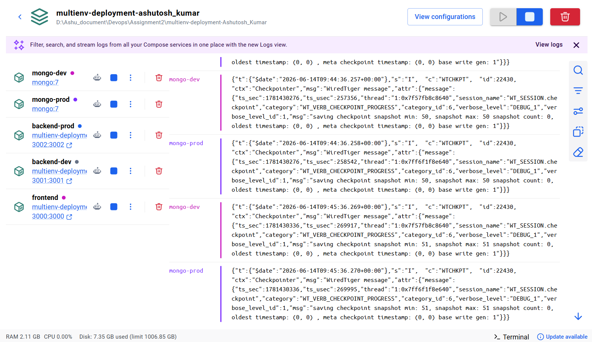
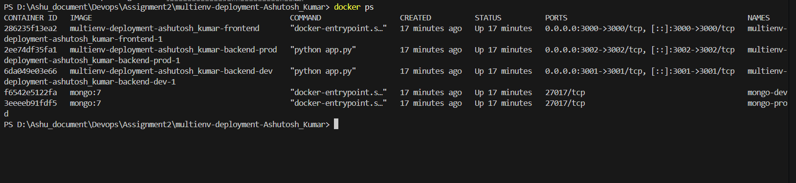
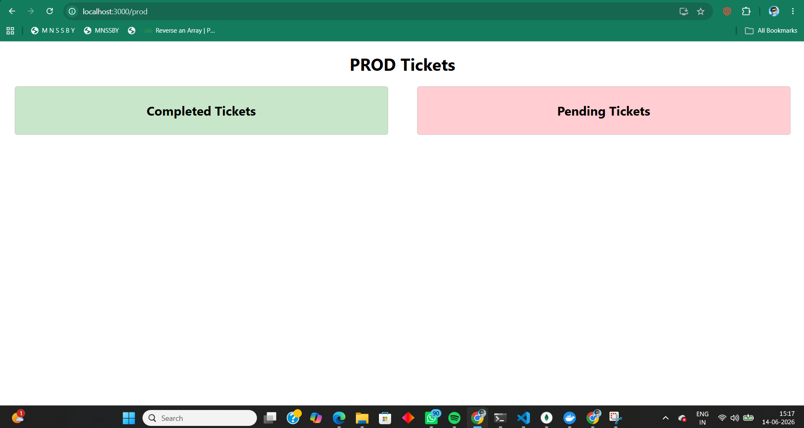
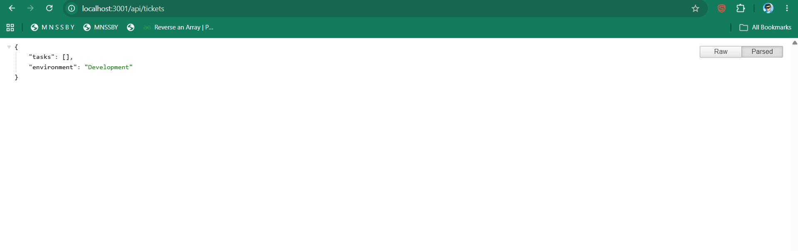
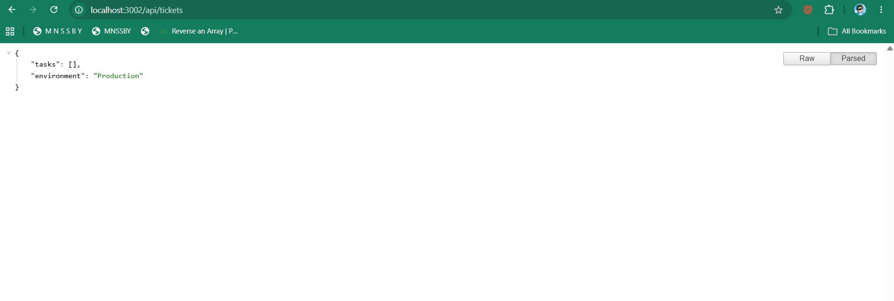

# Multi-Environment Application Deployment

## Project Overview

This project demonstrates the deployment of a multi-environment Ticket Management Application using Docker and Docker Compose.

The application consists of:

- React Frontend
- Flask Development Backend
- Flask Production Backend
- MongoDB Development Database
- MongoDB Production Database

The frontend communicates with both backend environments and displays ticket information based on the selected environment.

---

# Project Structure


multiEnv/
│
├── docker-compose.yml
│
├── backend/
│   ├── dev/
│   │   ├── app.py
│   │   ├── requirements.txt
│   │   ├── Dockerfile
│   │   └── .env
│   │
│   └── prod/
│       ├── app.py
│       ├── requirements.txt
│       ├── Dockerfile
│       └── .env
│
└── frontend/
    ├── src/
    ├── public/
    ├── package.json
    ├── package-lock.json
    └── Dockerfile
```

---

# Architecture

```text
                    React Frontend
                        Port 3000
                             |
        -----------------------------------------
        |                                       |
        |                                       |
        v                                       v

 Development Backend                    Production Backend
      Port 3001                             Port 3002
           |                                     |
           |                                     |
           v                                     v

 MongoDB Development                     MongoDB Production
      Database                               Database
```

---

# Technology Stack

| Component | Technology |
|------------|------------|
| Frontend | React |
| Backend | Flask |
| Database | MongoDB |
| Containerization | Docker |
| Orchestration | Docker Compose |

---

# Environment Details

| Component | Version |
|------------|---------|
| Operating System | Windows 11 |
| Docker Desktop | Latest |
| Docker Compose | Latest |
| Node.js | 20.x |
| Python | 3.11 |
| MongoDB | 7 |

---

# Prerequisites

Before running the application, install:

- Git
- Docker Desktop
- Docker Compose
- Node.js (Optional)

Verify installation:

```bash
docker version
docker compose version
```

---

## Step 1: Build Docker Images

```bash
docker compose build
```

---

## Step 2: Start All Containers

```bash
docker compose up -d
```

---

## Step 3: Verify Running Containers

```bash
docker ps
```

Expected Containers:

- frontend
- backend-dev
- backend-prod
- mongo-dev
- mongo-prod

---

# Access URLs

## Frontend Dashboard

```text
http://localhost:3000
```

## Development Environment

```text
http://localhost:3000/dev
```

## Production Environment

```text
http://localhost:3000/prod
```

## Development Backend API

```text
http://localhost:3001/api/tickets
```

## Production Backend API

```text
http://localhost:3002/api/tickets
```

---

# Testing and Verification

## Verify Development API

```bash
curl http://localhost:3001/api/tickets
```

Expected Response:

```json
{
  "tasks": [],
  "environment": "Development"
}
```

---

## Verify Production API

```bash
curl http://localhost:3002/api/tickets
```

Expected Response:

```json
{
  "tasks": [],
  "environment": "Production"
}
```

---

## Verify Running Containers

```bash
docker ps
```

---

## View Logs

```bash
docker logs backend-dev
docker logs backend-prod
docker logs frontend
```

---

# Screenshots

Create a folder named `screenshots` and add all screenshots there.

## Docker Desktop Running



---

## Docker Compose Build



---

## Running Containers


---

## Frontend Dashboard



---


## Development API Response



---

## Production API Response



---

# Assumptions

- Docker Desktop is installed and running.
- Internet access is available for downloading Docker images.
- Ports 3000, 3001 and 3002 are available.
- MongoDB runs inside Docker containers.

---

# Evidence Collected

- Docker Desktop Running
- Docker Compose Build Output
- Docker Container Status
- Frontend Screenshots
- Development Environment Screenshots
- Production Environment Screenshots
- API Response Screenshots
- Container Log Screenshots

---


Repository Name:

```text
multienv-deployment-Ashutosh_Kumar
```

Deployment Status:

```text
Working
```

Author:

```text
Ashutosh Kumar
```
